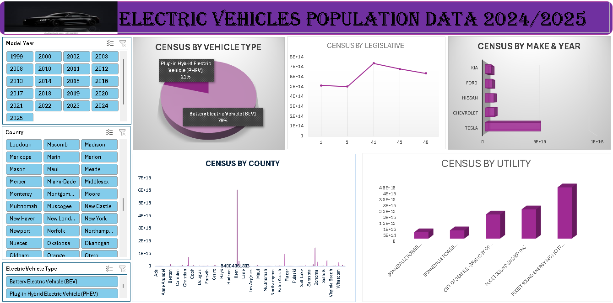

# Project 1

**Title:** [Electric Vehincle Population](https://github.com/gabrieladesina/gabriel.github.io/blob/main/Electric_Car%20Dashboard.xlsx)

**Tools Used:** Advanced Microsoft Excel (Pivot Table, Pivot Chart, Slicers, Timeline)

**Project Description:** This project involved analysing product data of cookies company to identify trends and patterns in sales performance for 2020. It is designed to provide a comprehensive overview of key performance metrics. This dashboard allows stakeholders to easily monitor and analyze the company’s performance across different regions, products, and time periods. The dashboard includes the following features:

Profit by Country and Cookies: Visual representation of profits broken down by each country and type of cookie.

Total Units Sold per Month: A monthly breakdown of the total units sold, providing insights into sales trends over time.

Profit by Month: Displays the monthly profit, allowing for easy comparison of profitability throughout the year.

Total Revenue by Country: Highlights the total revenue generated in each country, showcasing the performance in different markets.

Additionally, the dashboard includes interactive slicers and timeline for:

Month: Filter the data to view performance for a specific month or range of months.

Country: Focus on specific countries to analyze regional performance.

Product: Drill down into the performance of individual cookie products.

**Key findings:** Regional Profitability: Identified the most profitable countries and highlighted regions where performance could be improved.

Seasonal Trends: Revealed patterns in sales and profit that correspond with seasonal events, allowing for more strategic planning.

Top-Performing Products: Highlighted which cookie products are driving the most revenue and profit, aiding in inventory and marketing decisions.

Sales Volatility: Analyzed monthly sales fluctuations to understand market dynamics and adjust business strategies accordingly.

This dashboard serves as a crucial tool for the cookies company’s management team, providing clear, actionable insights that drive informed decision-making and strategic planning.

**Dashboard Overview:**

 

 # Project 2

**Title:**

**SQL Code:**[Empoyee_Info SQL code](https://github.com/gabrieladesina/gabriel.github.io/blob/main/Employee_Info.sql)

**SQL Skills Used:** Data Retrieval (SELECT): Queried and extracted specific information from the database.
Data Aggregation (SUM, COUNT): Calculated totals, such as sales and quantities, and counted records to analyze data trends.
Data Filtering (WHERE, BETWEEN, IN, AND): Applied filters to select relevant data, including filtering by ranges and lists.
Data Source Specification (FROM): Specified the tables used as data sources for retrieval

**Project Description:** This project involved analysing product data of cookies company to identify trends and patterns in sales performance for 2020. It is designed to provide a comprehensive overview of key performance metrics. This dashboard allows stakeholders to easily monitor and analyze the company’s performance across different regions, products, and time periods. The dashboard includes the following features:

Profit by Country and Cookies: Visual representation of profits broken down by each country and type of cookie.

Total Units Sold per Month: A monthly breakdown of the total units sold, providing insights into sales trends over time.

Profit by Month: Displays the monthly profit, allowing for easy comparison of profitability throughout the year.

Total Revenue by Country: Highlights the total revenue generated in each country, showcasing the performance in different markets.

Additionally, the dashboard includes interactive slicers and timeline for:

Month: Filter the data to view performance for a specific month or range of months.

Country: Focus on specific countries to analyze regional performance.

Product: Drill down into the performance of individual cookie products.

**Technology used:** SQL server

